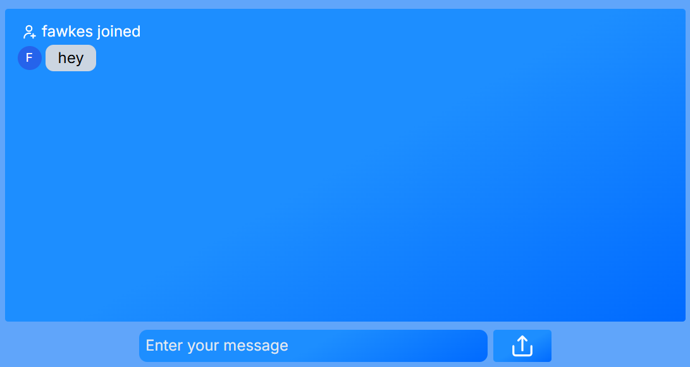

# Real-Time Chat App

A simple real-time chat application built with **Next.js**, **Express.js**, **Tailwind CSS**, and **Socket.IO** for instant messaging. This project is a test/demo showing how frontend and backend can communicate in real-time.

---

## Features

* Real-time messaging with Socket.IO
* Next.js frontend for modern UI and fast navigation
* Tailwind CSS styling for responsive design
* Express.js backend for socket event handling
* User join/leave notifications
* Works on desktop and mobile

---

## Tech Stack

**Frontend:**

* [Next.js](https://nextjs.org/)
* [Tailwind CSS](https://tailwindcss.com/)

**Backend:**

* [Express.js](https://expressjs.com/)
* [Socket.IO](https://socket.io/)

---

## Installation

### 1. Clone the repository

```bash
git clone https://github.com/your-username/realtime-chat.git
cd realtime-chat
```

### 2. Install dependencies

```bash
npm install
```

### 3. Start the backend server

```bash
cd server
npm install
npm run dev
```

### 4. Start the Next.js frontend

```bash
cd client
npm install
npm run dev
```

---

## Usage

1. Run both the **server** and **client**.
2. Open the client in your browser at `http://localhost:3000`.
3. Enter your name and join the chat.
4. Start sending messages in real-time.

---

## Development Notes

* This project is a **test/demo** and not intended for production use.
* For production, add authentication, message persistence, and deployment setup.

---

## Screenshots



---

## License
MIT
